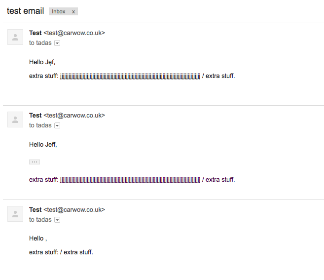

# Issue with Mandrillapp

We noticed that some of our emails are getting delivered without
any template variables set (passed via `X-MC-MergeVars` header).

Here are sample three emails:

Number 1, no issues:

    Date: Thu, 17 Nov 2016 09:53:37 +0000
    From: test@carwow.co.uk
    To: tadas@carwow.co.uk
    Message-ID: <582d7e21603a1_112293fe7e124561884970@boo-1061.local.mail>
    Subject: test email
    Mime-Version: 1.0
    Content-Type: text/html;
     charset=UTF-8
    Content-Transfer-Encoding: 7bit
    X-MC-Template: test_template
    X-MC-MergeLanguage: handlebars
    X-MC-MergeVars: {"junk":"jjjjjjjjjjjjjjjjjjjjjjjjjjjjjjjjjjjjjjjjjjjjjjjjjjjjjjjjjjjjjjjjjjjjjjjjjjjjjjjjjjjjjjjjjjjjjjjjjjjj","user_name":"Jeff"}
    
    <!DOCTYPE html>
    <html>
      <head>
        <meta http-equiv="Content-Type" content="text/html; charset=utf-8" />
        
      </head>
    
      <body>
        ---
      </body>
    </html>
    
Number 2, with some UTF-8 characters, no issues:
    
    Date: Thu, 17 Nov 2016 09:53:37 +0000
    From: test@carwow.co.uk
    To: tadas@carwow.co.uk
    Message-ID: <582d7e2167110_112293fe7e1245618850ce@boo-1061.local.mail>
    Subject: test email
    Mime-Version: 1.0
    Content-Type: text/html;
     charset=UTF-8
    Content-Transfer-Encoding: 7bit
    X-MC-Template: test_template
    X-MC-MergeLanguage: handlebars
    X-MC-MergeVars: =?UTF-8?Q?{=22junk=22:=22jjjjjjjjjjjjjjjjjjjjjjjjjjjjjjjjjjjjjjjjjjjjjjjjjjjjjjjjjjjjjjjjjjjjjjjjjjjjjjjjjjjjjjjjjjjjjjjjjjjj=22,=22user=5Fname=22:=22J=C4=99f=22}?=
    
    <!DOCTYPE html>
    <html>
      <head>
        <meta http-equiv="Content-Type" content="text/html; charset=utf-8" />
        
      </head>
    
      <body>
        ---
      </body>
    </html>

Number 3, with some UTF-8 characters, **template variables are lost**:

    Date: Thu, 17 Nov 2016 09:53:37 +0000
    From: test@carwow.co.uk
    To: tadas@carwow.co.uk
    Message-ID: <582d7e216e845_112293fe7e12456188517f@boo-1061.local.mail>
    Subject: test email
    Mime-Version: 1.0
    Content-Type: text/html;
     charset=UTF-8
    Content-Transfer-Encoding: 7bit
    X-MC-Template: test_template
    X-MC-MergeLanguage: handlebars
    X-MC-MergeVars: =?UTF-8?Q?{=22junk=22:=22jjjjjjjjjjjjjjjjjjjjjjjjjjjjjjjjjjjjjjjjjjjjjjjjjjjjjjjjjjjjjjjjjjjjjjjjjjjjjjjjjjjjjjjjjjjjjjjjjjjj=22,=22user=5Fname=22:=22J=C4=99=C4=99=C4=99=C4=99f=22}?=
    
    <!DOCTYPE html>
    <html>
      <head>
        <meta http-equiv="Content-Type" content="text/html; charset=utf-8" />
        
      </head>
    
      <body>
        ---
      </body>
    </html>
    
So issue seems to occur with this particular `X-MC-MergeVars` header which seems to be
a valid, ASCII safe UTF-8 value:

    X-MC-MergeVars: =?UTF-8?Q?{=22junk=22:=22jjjjjjjjjjjjjjjjjjjjjjjjjjjjjjjjjjjjjjjjjjjjjjjjjjjjjjjjjjjjjjjjjjjjjjjjjjjjjjjjjjjjjjjjjjjjjjjjjjjj=22,=22user=5Fname=22:=22J=C4=99=C4=99=C4=99=C4=99f=22}?=

And here's a result of all three emails after being delivered by Mandrillapp:

Last email should say "Hello Jęęęęf," + display the other variable as well.

## Template used for testing

    

    Hello {{user_name}},
    

    
    

        extra stuff: {{junk}} / extra stuff.
    

